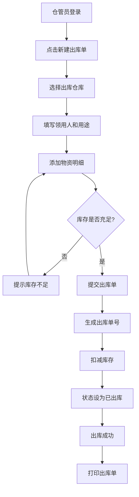
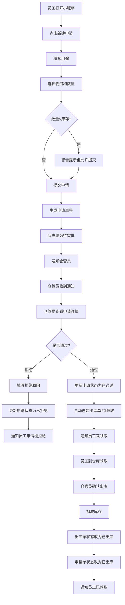
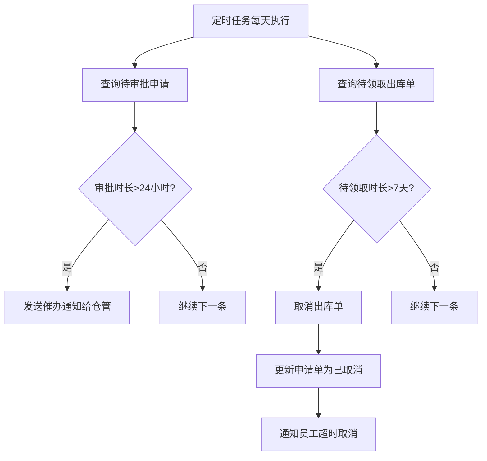
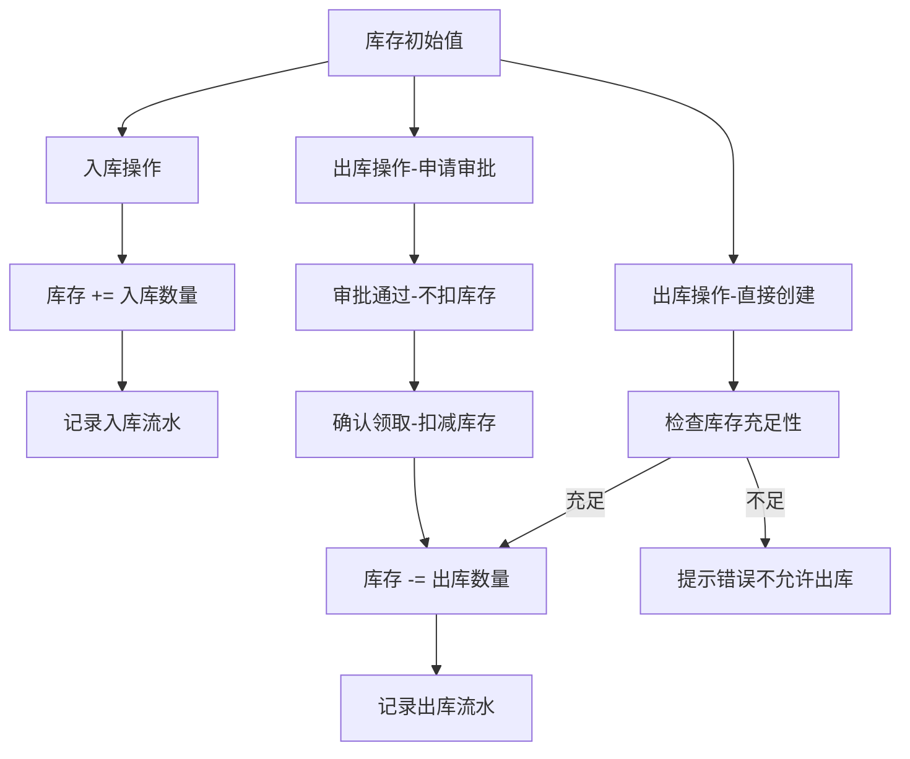

# 仓库管理系统产品需求文档 (PRD)

## 文档信息

| 项目 | 内容 |
|------|------|
| 产品名称 | 西藏电信仓库管理系统 (CT-Tibet-WMS) |
| 版本 | v1.0 MVP |
| 文档状态 | 待评审 |
| 创建日期 | 2025-11-10 |
| 作者 | 产品团队 |
| 目标用户 | 系统管理员、部门管理员、仓库管理员、普通员工 |

---

## 目录

1. [产品概述](#1-产品概述)
2. [用户分析](#2-用户分析)
3. [核心功能](#3-核心功能)
4. [用户故事与用例](#4-用户故事与用例)
5. [功能详细说明](#5-功能详细说明)
6. [用户界面设计](#6-用户界面设计)
7. [业务流程](#7-业务流程)
8. [数据模型](#8-数据模型)
9. [非功能性需求](#9-非功能性需求)
10. [技术架构](#10-技术架构)
11. [项目计划](#11-项目计划)
12. [风险与依赖](#12-风险与依赖)
13. [成功指标](#13-成功指标)

---

## 1. 产品概述

### 1.1 产品背景

西藏电信公司目前有7个部门，每个部门拥有独立的仓库用于管理本部门的物资（光缆、交换机、网线等通信设备）。当前物资管理存在以下痛点：

- **手工记账**：出入库登记依赖纸质表格，容易出错且查询困难
- **权限混乱**：无法区分仓管员和普通员工的操作权限
- **审批缺失**：普通员工领用物资缺乏管控机制
- **库存不准**：无法实时查看各部门库存情况
- **追溯困难**：历史记录难以查询和统计

### 1.2 产品定位

开发一套基于 Web + 移动端的仓库管理系统，实现：

- **数字化管理**：所有出入库操作线上化、电子化
- **分级权限**：区分仓管员直接操作和普通员工申请审批
- **多部门隔离**：各部门仓库数据独立管理
- **移动化办公**：支持小程序随时随地操作
- **数据可视化**：实时库存查询和统计分析

### 1.3 产品目标

**业务目标**：
- 提升仓库管理效率 50%
- 减少物资损耗和错误发放 80%
- 实现物资领用全流程可追溯

**用户目标**：
- 仓管员：简化操作流程，提高工作效率
- 普通员工：随时随地提交申请，实时查看进度
- 管理层：掌握各部门物资使用情况

**技术目标**：
- 系统响应时间 < 2秒
- 支持 400+ 并发用户
- 99.5% 系统可用性

### 1.4 产品范围

**包含功能**：
- ✅ 用户权限管理（RBAC）
- ✅ 物资、仓库、部门基础数据管理
- ✅ 入库管理（仓管直接操作）
- ✅ 出库管理（仓管直接出库 + 员工申请出库）
- ✅ 申请审批流程
- ✅ 库存查询和统计
- ✅ 消息通知（站内 + 微信）
- ✅ PC 管理端 + 移动小程序端

**不包含功能**（后续版本）：
- ❌ 采购管理
- ❌ 供应商管理
- ❌ 财务对账
- ❌ 高级数据分析（BI）
- ❌ 多仓库调拨

---

## 2. 用户分析

### 2.1 用户角色

| 角色 | 人数 | 主要职责 | 使用场景 | 技术水平 |
|------|------|----------|----------|----------|
| **系统管理员** | 1人 | 系统配置、全局管理 | PC端后台管理 | 高 |
| **部门管理员** | 7人 | 管理本部门仓库、用户、数据 | PC端 + 小程序 | 中 |
| **仓库管理员** | 14人 | 出入库操作、审批员工申请 | PC端 + 小程序（高频） | 中 |
| **普通员工** | 400+人 | 申请领用物资、查看库存 | 小程序（主要） | 低-中 |

### 2.2 用户画像

#### 画像1：仓库管理员 - 李军（35岁）

**基本信息**：
- 网络运维部仓库管理员，工作5年
- 负责部门所有通信设备的出入库管理
- 每天处理 10-20 次出入库操作

**需求与痛点**：
- ✅ 需要快速完成出入库操作，不想被审批流程拖慢
- ✅ 需要审批普通员工的申请，避免物资被误领或超领
- ✅ 希望在仓库现场用手机完成操作，不必每次回办公室开电脑
- ❌ 不喜欢复杂的系统，希望界面简洁、操作流畅

**使用场景**：
- 早上收到采购的光缆，现场用小程序快速入库
- 工程需要紧急领用交换机，直接创建出库单
- 收到张三的申请，在小程序上审批并通知他来领取

#### 画像2：普通员工 - 张强（28岁）

**基本信息**：
- 网络运维工程师，经常外出施工
- 平均每月需要领用物资 2-3 次
- 主要使用微信小程序

**需求与痛点**：
- ✅ 希望在施工现场就能提交申请，不用回办公室
- ✅ 希望实时知道申请是否通过
- ✅ 希望操作简单，几步就能完成申请
- ❌ 不想下载单独的APP，希望用微信小程序

**使用场景**：
- 在施工现场发现缺少光缆，立即打开小程序申请
- 收到审批通过通知，到仓库领取物资
- 查询历史申请记录

### 2.3 用户权限矩阵

| 功能模块 | 系统管理员 | 部门管理员 | 仓库管理员 | 普通员工 |
|---------|-----------|-----------|-----------|---------|
| 用户管理 | ✅ 全部 | ✅ 本部门 | ❌ | ❌ |
| 部门管理 | ✅ | ❌ | ❌ | ❌ |
| 物资管理 | ✅ | ✅ | ✅ 查看 | ✅ 查看 |
| 仓库管理 | ✅ | ✅ 本部门 | ✅ 本部门 | ❌ |
| 入库操作 | ✅ | ✅ | ✅ | ❌ |
| 直接出库 | ✅ | ✅ | ✅ | ❌ |
| 申请出库 | ❌ | ❌ | ❌ | ✅ |
| 审批申请 | ✅ | ✅ | ✅ | ❌ |
| 库存查询 | ✅ 全部 | ✅ 本部门 | ✅ 本部门 | ✅ 只读 |
| 统计报表 | ✅ 全部 | ✅ 本部门 | ✅ 本部门 | ❌ |

---

## 3. 核心功能

### 3.1 功能架构图

```
仓库管理系统
│
├── 系统管理
│   ├── 用户管理
│   ├── 角色管理
│   └── 部门管理
│
├── 基础数据
│   ├── 物资管理
│   └── 仓库管理
│
├── 入库管理
│   └── 入库单管理（无审批）
│
├── 出库管理
│   ├── 直接出库（仓管操作，无审批）
│   └── 申请出库（员工申请 → 仓管审批 → 确认领取）
│
├── 申请审批
│   ├── 提交申请（员工）
│   ├── 审批管理（仓管）
│   └── 我的申请（员工）
│
├── 库存管理
│   ├── 库存查询
│   ├── 库存预警
│   └── 库存盘点
│
├── 统计报表
│   ├── 出入库统计
│   ├── 物资使用统计
│   └── 审批统计
│
└── 消息通知
    ├── 站内消息
    └── 微信模板消息
```

### 3.2 核心功能优先级

| 优先级 | 功能模块 | 说明 |
|-------|---------|------|
| **P0** | 用户权限管理 | 系统基础，必须首先实现 |
| **P0** | 入库管理 | 仓管直接操作，无审批 |
| **P0** | 直接出库 | 仓管直接操作，无审批 |
| **P0** | 申请审批流程 | 核心业务流程 |
| **P1** | 库存查询 | 支持实时库存查看 |
| **P1** | 消息通知 | 申请状态通知 |
| **P1** | 小程序端 | 移动办公支持 |
| **P2** | 统计报表 | 数据分析 |
| **P2** | 库存预警 | 低库存提醒 |

---

## 4. 用户故事与用例

### 4.1 Epic 1: 仓库管理员直接出入库

#### 用户故事 1.1：仓管员快速入库

**作为** 仓库管理员
**我想要** 快速录入入库信息
**以便** 及时更新库存，不耽误工作

**验收标准**：
- ✅ 能够选择仓库和物资
- ✅ 能够输入数量和备注
- ✅ 提交后库存立即增加
- ✅ 支持批量添加多个物资
- ✅ 操作时间 < 1分钟

**用例描述**：
```
前置条件：仓管员已登录系统
基本流程：
1. 仓管员点击"入库管理" → "新建入库单"
2. 系统显示入库单表单
3. 仓管员选择仓库（默认本部门仓库）
4. 仓管员添加物资：
   - 点击"添加物资"按钮
   - 从物资列表中选择"光缆12芯"
   - 输入数量：100
   - 输入备注：采购入库
5. 仓管员可继续添加更多物资
6. 仓管员点击"提交"
7. 系统验证数据完整性
8. 系统生成入库单号（RK_部门_日期_流水号）
9. 系统更新库存（库存 += 100）
10. 系统提示"入库成功"
11. 系统跳转到入库单详情页
后置条件：库存已更新，入库记录已保存

异常流程：
- 3a. 物资不存在 → 提示"请先添加物资"
- 6a. 数量为空或 ≤ 0 → 提示"请输入正确的数量"
- 6b. 网络异常 → 提示"提交失败，请重试"
```

#### 用户故事 1.2：仓管员直接出库

**作为** 仓库管理员
**我想要** 直接创建出库单而不需要审批
**以便** 快速处理紧急情况或自己的领用需求

**验收标准**：
- ✅ 能够选择领用人（可以是自己或他人）
- ✅ 能够选择多个物资
- ✅ 系统自动检查库存是否充足
- ✅ 提交后库存立即扣减
- ✅ 生成出库单可打印

**用例描述**：
```
前置条件：仓管员已登录，仓库有库存
基本流程：
1. 仓管员点击"出库管理" → "新建出库单"
2. 系统显示出库单表单
3. 仓管员填写：
   - 领用人：张三（可搜索员工）
   - 领用类型：工程领用
   - 用途：XX小区光缆施工
4. 仓管员添加物资：
   - 选择"光缆12芯"，输入数量：10
   - 系统显示当前库存：850条 ✓
5. 仓管员点击"提交"
6. 系统检查库存充足性
7. 系统生成出库单号（CK_部门_日期_流水号）
8. 系统扣减库存（库存 -= 10）
9. 系统更新出库单状态为"已出库"
10. 系统提示"出库成功"
11. 系统提供打印选项
后置条件：库存已扣减，出库记录已保存

异常流程：
- 6a. 库存不足 → 提示"光缆12芯库存不足，当前库存：5条"，不允许提交
- 6b. 领用人不存在 → 提示"请选择有效的领用人"
```

### 4.2 Epic 2: 普通员工申请领用

#### 用户故事 2.1：员工提交申请

**作为** 普通员工
**我想要** 在小程序上快速提交领用申请
**以便** 不用到仓库现场，节省时间

**验收标准**：
- ✅ 小程序界面简洁易用
- ✅ 能够选择多个物资
- ✅ 能够查看当前库存
- ✅ 提交后收到确认通知
- ✅ 能够实时查看申请状态

**用例描述**：
```
前置条件：员工已登录小程序
基本流程：
1. 员工打开小程序，点击底部"申请"
2. 系统显示"新建申请"按钮
3. 员工点击"新建申请"
4. 系统显示申请表单
5. 员工填写用途："XX小区光缆施工"
6. 员工点击"选择物资"
7. 系统显示物资列表（带库存信息）
8. 员工选择"光缆12芯"（库存：850条）
9. 员工输入数量：10
10. 员工点击"确定"
11. 系统验证数量 ≤ 库存（10 ≤ 850 ✓）
12. 物资已添加到申请单
13. 员工可继续添加更多物资
14. 员工点击"提交申请"
15. 系统生成申请单号（SQ_部门_日期_流水号）
16. 系统设置状态为"待审批"
17. 系统发送通知给本部门仓管员
18. 系统显示"申请提交成功"页面
19. 员工收到微信模板消息："申请已提交，等待审批"
后置条件：申请单已创建，仓管员收到通知

异常流程：
- 5a. 用途为空 → 提示"请填写用途"
- 11a. 数量 > 库存 → 警告"申请数量大于库存，可能会被拒绝"，但允许提交
- 14a. 未选择物资 → 提示"请至少选择一个物资"
```

#### 用户故事 2.2：员工查看申请状态

**作为** 普通员工
**我想要** 随时查看我的申请进度
**以便** 了解什么时候可以领取物资

**验收标准**：
- ✅ 能够看到所有历史申请
- ✅ 能够按状态筛选（待审批、已通过、已拒绝）
- ✅ 能够查看审批意见
- ✅ 待审批状态可以撤销
- ✅ 已通过状态显示领取地点

**用例描述**：
```
前置条件：员工已登录小程序，有历史申请
基本流程：
1. 员工打开小程序，点击底部"申请"
2. 系统显示"我的申请"列表
3. 员工看到申请卡片：
   - 申请单号：SQ_WL_20251110_0001
   - 物资：光缆等2项
   - 申请时间：11-10 09:30
   - 状态：⏳待审批
4. 员工点击申请卡片
5. 系统显示申请详情：
   - 申请人：张强
   - 用途：XX小区光缆施工
   - 物资明细：光缆12芯 10条、交换机H3C 2台
   - 申请时间：2025-11-10 09:30
   - 当前状态：待审批
6. 员工点击"撤销申请"按钮
7. 系统弹出确认对话框："确定要撤销吗？"
8. 员工点击"确定"
9. 系统更新申请状态为"已取消"
10. 系统提示"申请已撤销"
11. 系统发送通知给仓管员："张强撤销了申请"
后置条件：申请已取消

异常流程：
- 6a. 申请已通过 → 不显示"撤销"按钮
- 6b. 申请已拒绝 → 显示"重新申请"按钮
```

### 4.3 Epic 3: 仓管员审批申请

#### 用户故事 3.1：仓管员审批申请

**作为** 仓库管理员
**我想要** 快速审批员工的申请
**以便** 把关物资使用，避免浪费

**验收标准**：
- ✅ 能够看到所有待审批申请
- ✅ 能够查看申请详情和库存信息
- ✅ 能够通过或拒绝申请
- ✅ 拒绝时必须填写原因
- ✅ 通过后自动创建出库单

**用例描述**：
```
前置条件：仓管员已登录，有待审批申请
基本流程：
1. 仓管员打开PC端"审批管理" → "待审批"
2. 系统显示待审批列表（3条）：
   - SQ_WL_0001 | 张强 | 光缆 10条 | 11-10 09:30
   - SQ_WL_0002 | 李四 | 交换机 2台 | 11-10 10:00
   - SQ_WL_0003 | 王五 | 网线 50米 | 11-10 11:00
3. 仓管员点击第一条申请
4. 系统显示审批详情页：
   - 申请人：张强（网络运维部）
   - 申请时间：2025-11-10 09:30
   - 用途：XX小区光缆施工
   - 物资明细：
     * 光缆12芯，数量：10，当前库存：850 ✓
     * 交换机H3C，数量：2，当前库存：23 ✓
   - 库存检查：✓ 库存充足
5. 仓管员判断：用途合理，库存充足
6. 仓管员填写审批意见："同意"
7. 仓管员点击"通过"按钮
8. 系统执行审批通过逻辑：
   - 更新申请单状态为"已通过"
   - 记录审批人ID和审批时间
   - 自动创建出库单（状态：待领取）
   - 出库单关联申请单ID
9. 系统发送通知给张强："您的申请已通过，请到XX仓库领取"
10. 系统提示"审批成功"
11. 系统返回待审批列表（剩余2条）
后置条件：申请已通过，出库单已创建，员工收到通知

异常流程：
- 5a. 库存不足（库存：5 < 申请：10）
  → 系统提示"⚠️ 光缆12芯库存不足，建议拒绝或联系申请人修改数量"
  → 仓管员选择拒绝
  → 填写拒绝原因："库存不足，请减少数量"
  → 系统更新申请状态为"已拒绝"
  → 系统发送通知给张强："您的申请已拒绝，原因：库存不足，请减少数量"
```

#### 用户故事 3.2：仓管员确认领取

**作为** 仓库管理员
**我想要** 在员工来领取物资时确认出库
**以便** 确保物资交付并扣减库存

**验收标准**：
- ✅ 能够看到所有待领取的出库单
- ✅ 能够核对领用人身份
- ✅ 确认后库存立即扣减
- ✅ 员工收到领取成功通知

**用例描述**：
```
前置条件：申请已通过，出库单状态为"待领取"，员工来到仓库
基本流程：
1. 员工张强到仓库："我是张强，来领光缆"
2. 仓管员打开PC端"出库管理" → "待领取"
3. 系统显示待领取列表：
   - CK_WL_0001 | 张强 | 光缆等2项 | 11-10 10:00 | 待领取
4. 仓管员点击"确认出库"按钮
5. 系统弹出确认对话框：
   - 领用人：张强
   - 物资：光缆12芯 10条、交换机H3C 2台
   - 员工已签字：□ 是  □ 否
6. 仓管员让张强签字（纸质单据或电子签名）
7. 仓管员勾选"是"
8. 仓管员点击"确认"
9. 系统执行确认出库逻辑：
   - 检查库存充足性（再次验证）
   - 扣减库存：光缆 -= 10，交换机 -= 2
   - 更新出库单状态为"已出库"
   - 更新申请单状态为"已出库"
   - 记录出库时间
10. 系统提示"出库成功，库存已更新"
11. 系统发送通知给张强："您已领取物资，请妥善保管"
12. 张强拿着物资离开
后置条件：库存已扣减，出库单完成，申请流程结束

异常流程：
- 9a. 库存不足（扣减前再次检查）
  → 系统提示"库存不足，无法出库。光缆12芯当前库存：5条，需要：10条"
  → 仓管员联系申请人修改数量或等待补货
- 9b. 出库单已取消
  → 系统提示"该出库单已取消，无法确认出库"
```

### 4.4 Epic 4: 库存管理

#### 用户故事 4.1：查询库存

**作为** 任何用户
**我想要** 查询当前库存情况
**以便** 了解物资可用性

**验收标准**：
- ✅ 能够查看所有物资的库存数量
- ✅ 能够按物资名称搜索
- ✅ 能够按仓库筛选
- ✅ 显示低库存预警
- ✅ 支持导出Excel

**用例描述**：
```
前置条件：用户已登录
基本流程：
1. 用户点击"库存管理" → "库存查询"
2. 系统显示库存列表：
   ┌─────────┬──────┬──────┬──────┬────┐
   │ 物资名称 │ 规格 │ 单位 │ 库存 │状态│
   ├─────────┼──────┼──────┼──────┼────┤
   │ 光缆12芯 │ 12芯 │ 条   │ 850  │ 正常│
   │ 交换机   │ H3C  │ 台   │ 23   │ 正常│
   │ 网线     │ 超五类│ 米   │ 8    │⚠️低 │
   └─────────┴──────┴──────┴──────┴────┘
3. 用户在搜索框输入"光缆"
4. 系统过滤显示包含"光缆"的物资
5. 用户点击"光缆12芯"行
6. 系统显示详情：
   - 物资名称：光缆12芯
   - 规格：12芯单模
   - 当前库存：850条
   - 预警阈值：100条
   - 所属仓库：网络运维部仓库
   - 近期动态：
     * 11-10 入库 +100 | 采购入库
     * 11-09 出库 -50 | 张强领用
后置条件：用户了解库存情况

权限控制：
- 系统管理员：查看所有部门库存
- 部门管理员/仓管员：查看本部门库存
- 普通员工：查看所有部门库存（只读）
```

---

## 5. 功能详细说明

### 5.1 用户权限管理

#### 5.1.1 用户管理

**功能描述**：管理系统用户的增删改查

**字段设计**：
```sql
tb_user:
- id: 用户ID
- username: 登录名（唯一）
- password: 密码（加密存储）
- real_name: 真实姓名
- phone: 手机号
- email: 邮箱
- dept_id: 所属部门
- role_id: 角色ID
- status: 状态（0启用 1禁用）
- wechat_openid: 微信openid（小程序登录用）
- create_time: 创建时间
- update_time: 更新时间
```

**操作功能**：
- **新增用户**：填写用户信息，分配部门和角色
- **编辑用户**：修改用户信息（密码单独修改）
- **禁用用户**：设置status=1，用户无法登录
- **重置密码**：管理员可重置为默认密码
- **批量导入**：支持Excel导入用户

**业务规则**：
- 登录名全局唯一
- 手机号全局唯一
- 默认密码：123456（首次登录强制修改）
- 禁用用户不能登录但数据保留

#### 5.1.2 角色管理

**功能描述**：管理系统角色和权限

**预设角色**：
```
1. 系统管理员 (admin)
   - 权限：全部功能

2. 部门管理员 (dept_admin)
   - 权限：管理本部门用户、仓库、出入库、审批

3. 仓库管理员 (warehouse)
   - 权限：本部门出入库、审批

4. 普通员工 (user)
   - 权限：申请出库、查看库存
```

**权限设计**：采用 RBAC（角色-权限-资源）模型

```
角色 → 权限 → 资源
例如：
warehouse → outbound:create → 创建出库单
warehouse → apply:approve → 审批申请
user → apply:create → 创建申请
user → inventory:view → 查看库存
```

#### 5.1.3 部门管理

**功能描述**：管理公司组织架构

**字段设计**：
```sql
tb_dept:
- id: 部门ID
- dept_name: 部门名称
- dept_code: 部门编码（用于单号生成）
- parent_id: 上级部门ID（支持多级）
- leader_id: 部门负责人
- phone: 联系电话
- status: 状态（0启用 1禁用）
- sort: 排序
- create_time: 创建时间
```

**预设部门**（根据西藏电信实际情况）：
```
├── 西藏电信
    ├── 网络运维部 (WL)
    ├── 市场营销部 (SC)
    ├── 客户服务部 (KF)
    ├── 财务部 (CW)
    ├── 人力资源部 (RZ)
    ├── 技术支持部 (JS)
    └── 综合管理部 (ZH)
```

### 5.2 基础数据管理

#### 5.2.1 物资管理

**功能描述**：管理仓库中的物资品类

**字段设计**：
```sql
tb_material:
- id: 物资ID
- material_name: 物资名称
- material_code: 物资编码（唯一）
- category: 物资类别（光缆、交换机、网线等）
- spec: 规格型号
- unit: 单位（条、台、米、个）
- price: 单价
- min_stock: 最低库存预警阈值
- description: 描述
- image: 图片URL
- status: 状态（0启用 1停用）
- create_time: 创建时间
```

**物资类别**（可配置）：
- 光缆类：光缆12芯、光缆24芯、光缆48芯
- 设备类：交换机、路由器、OLT设备、ONU设备
- 配件类：网线、光纤跳线、配线架、机柜
- 工具类：光纤熔接机、OTDR测试仪、网线钳

**操作功能**：
- 新增物资：填写物资信息，上传图片
- 编辑物资：修改物资信息
- 停用物资：status=1，不可用于出入库
- 导入物资：Excel批量导入

**业务规则**：
- 物资编码全局唯一
- 停用物资不能用于新的出入库单
- 有库存的物资不能删除（只能停用）

#### 5.2.2 仓库管理

**功能描述**：管理各部门仓库信息

**字段设计**：
```sql
tb_warehouse:
- id: 仓库ID
- warehouse_name: 仓库名称
- warehouse_code: 仓库编码
- dept_id: 所属部门
- address: 仓库地址
- manager_id: 仓库管理员ID
- capacity: 仓库容量
- status: 状态（0启用 1禁用）
- remark: 备注
- create_time: 创建时间
```

**业务规则**：
- 每个部门至少有一个仓库
- 仓库编码在部门内唯一
- 仓库管理员必须是本部门的仓管角色用户

### 5.3 入库管理

#### 5.3.1 入库单管理

**功能描述**：仓管员录入物资入库信息

**字段设计**：
```sql
tb_inbound:
- id: 入库单ID
- inbound_no: 入库单号（RK_部门编码_YYYYMMDD_流水号）
- warehouse_id: 入库仓库
- inbound_type: 入库类型（1采购入库 2退货入库 3调拨入库 4其他）
- operator_id: 操作人（仓管员）
- inbound_time: 入库时间
- total_amount: 入库总金额
- remark: 备注
- create_time: 创建时间

tb_inbound_detail:
- id: 明细ID
- inbound_id: 入库单ID
- material_id: 物资ID
- quantity: 入库数量
- unit_price: 单价
- amount: 金额（quantity * unit_price）
```

**操作流程**：
```
1. 点击"新建入库单"
2. 选择入库仓库（默认本部门仓库）
3. 选择入库类型
4. 添加物资明细：
   - 点击"添加物资"
   - 选择物资
   - 输入数量
   - 输入单价（可选）
   - 系统计算金额
5. 填写备注
6. 点击"提交"
7. 系统生成入库单号
8. 系统更新库存（inventory.quantity += detail.quantity）
9. 系统提示"入库成功"
```

**业务规则**：
- 仓管员只能在本部门仓库入库
- 入库数量必须 > 0
- 入库后不可修改（如需修改，需要创建负数入库单冲正）
- 入库单号自动生成，格式：RK_部门编码_20251110_0001

**小程序功能**：
- 支持小程序快速入库
- 支持扫码录入物资
- 支持拍照上传入库凭证

### 5.4 出库管理

#### 5.4.1 直接出库（仓管操作）

**功能描述**：仓管员直接创建出库单，无需审批

**字段设计**：
```sql
tb_outbound:
- id: 出库单ID
- outbound_no: 出库单号（CK_部门编码_YYYYMMDD_流水号）
- warehouse_id: 出库仓库
- outbound_type: 出库类型（1领用出库 2报废出库 3调拨出库 4其他）
- source: 出库来源（1直接创建 2申请自动创建）
- apply_id: 关联申请单ID（来源为2时）
- receiver_id: 领用人ID
- receiver_name: 领用人姓名
- purpose: 领用用途
- operator_id: 操作人（仓管员）
- outbound_time: 出库时间
- status: 状态（0待领取 1已出库 2已取消）
- create_time: 创建时间

tb_outbound_detail:
- id: 明细ID
- outbound_id: 出库单ID
- material_id: 物资ID
- quantity: 出库数量
```

**操作流程**：
```
1. 点击"新建出库单"
2. 选择出库仓库
3. 选择出库类型
4. 选择或输入领用人
5. 填写领用用途
6. 添加物资明细：
   - 选择物资
   - 输入数量
   - 系统显示当前库存
   - 系统检查：数量 ≤ 库存
7. 点击"提交"
8. 系统生成出库单号
9. 系统扣减库存（inventory.quantity -= detail.quantity）
10. 系统设置状态为"已出库"（直接创建时立即出库）
11. 系统提示"出库成功"
```

**业务规则**：
- 仓管员只能在本部门仓库出库
- 出库数量必须 > 0 且 ≤ 当前库存
- 直接创建的出库单立即扣减库存（status=1）
- 出库后不可修改（如需修改，需要创建入库单补回）

#### 5.4.2 申请出库（员工申请）

**功能描述**：普通员工提交申请，仓管审批通过后自动创建出库单

**字段设计**：
```sql
tb_apply:
- id: 申请单ID
- apply_no: 申请单号（SQ_部门编码_YYYYMMDD_流水号）
- applicant_id: 申请人ID
- dept_id: 申请人部门
- purpose: 领用用途
- apply_time: 申请时间
- status: 状态（0待审批 1已通过 2已拒绝 3已出库 4已取消）
- approver_id: 审批人ID
- approval_time: 审批时间
- approval_opinion: 审批意见
- outbound_id: 关联出库单ID（审批通过后自动创建）
- create_time: 创建时间

tb_apply_detail:
- id: 明细ID
- apply_id: 申请单ID
- material_id: 物资ID
- quantity: 申请数量
```

**员工操作流程**（小程序）：
```
1. 打开小程序，点击"申请"
2. 点击"新建申请"
3. 填写用途
4. 添加物资：
   - 点击"选择物资"
   - 选择物资（显示当前库存）
   - 输入数量
   - 系统提示：数量 > 库存时警告但允许提交
5. 点击"提交申请"
6. 系统生成申请单号
7. 系统设置状态为"待审批"
8. 系统发送通知给本部门仓管员
9. 系统提示"申请提交成功，等待审批"
10. 员工收到微信模板消息
```

**仓管审批流程**（PC端或小程序）：
```
1. 仓管员收到通知："有新申请待审批"
2. 打开"审批管理" → "待审批"
3. 点击某个申请查看详情
4. 系统显示：
   - 申请人信息
   - 申请用途
   - 物资明细（含当前库存）
   - 库存检查结果
5. 仓管员判断是否通过
6a. 通过：
   - 填写审批意见（可选）
   - 点击"通过"
   - 系统更新申请状态为"已通过"
   - 系统自动创建出库单（status=0待领取，source=2）
   - 系统发送通知给申请人："申请已通过，请到XX仓库领取"
6b. 拒绝：
   - 填写拒绝原因（必填）
   - 点击"拒绝"
   - 系统更新申请状态为"已拒绝"
   - 系统发送通知给申请人："申请已拒绝，原因：XXX"
```

**确认领取流程**：
```
1. 员工到仓库领取物资
2. 仓管员打开"出库管理" → "待领取"
3. 找到对应的出库单
4. 点击"确认出库"
5. 系统弹出确认对话框
6. 仓管员确认员工签字
7. 点击"确认"
8. 系统扣减库存
9. 系统更新出库单状态为"已出库"
10. 系统更新申请单状态为"已出库"
11. 系统发送通知给员工："您已领取物资"
```

**业务规则**：
- 员工只能提交本部门的申请
- 申请数量可以 > 库存（提交时警告，审批时仓管判断）
- 待审批状态可撤销，其他状态不可撤销
- 审批通过后不扣库存，确认领取时才扣库存
- 待领取超过7天自动取消（定时任务）

### 5.5 库存管理

#### 5.5.1 库存查询

**功能描述**：实时查看各仓库物资库存

**数据来源**：
```sql
tb_inventory:
- id: 库存ID
- warehouse_id: 仓库ID
- material_id: 物资ID
- quantity: 当前库存数量
- update_time: 最后更新时间

库存计算逻辑：
quantity = 初始库存 + 所有入库 - 所有出库
```

**查询功能**：
- 按物资名称搜索
- 按仓库筛选
- 按物资类别筛选
- 显示库存状态（正常/低库存/缺货）
- 导出Excel

**库存状态判断**：
```
quantity = 0: 缺货 ⛔
0 < quantity ≤ min_stock: 低库存 ⚠️
quantity > min_stock: 正常 ✓
```

**权限控制**：
- 系统管理员：查看所有仓库
- 部门管理员/仓管员：查看本部门仓库
- 普通员工：查看所有仓库（只读）

#### 5.5.2 库存预警

**功能描述**：低库存自动预警通知

**预警规则**：
```
IF quantity ≤ min_stock THEN
  发送预警通知给：
  - 仓库管理员
  - 部门管理员
  - 系统管理员
END IF
```

**预警方式**：
- 站内消息
- 小程序消息推送
- 每日汇总邮件（可选）

**预警频率**：
- 每天检查一次（定时任务）
- 库存变动时实时检查

#### 5.5.3 库存盘点（后期功能）

**功能描述**：定期盘点库存，调整账实差异

**盘点流程**：
```
1. 创建盘点单
2. 录入实际盘点数量
3. 系统计算差异（实际 - 账面）
4. 审核盘点单
5. 调整库存
```

### 5.6 统计报表

#### 5.6.1 出入库统计

**统计维度**：
- 按时间统计（日/周/月/年）
- 按部门统计
- 按物资统计
- 按操作人统计

**图表展示**：
- 出入库趋势图（折线图）
- 物资使用排行（柱状图）
- 部门领用对比（饼图）

#### 5.6.2 申请审批统计

**统计指标**：
- 申请总数
- 通过率
- 平均审批时长
- 超时未审批数量

**图表展示**：
- 审批状态分布（饼图）
- 审批时长趋势（折线图）

### 5.7 消息通知

#### 5.7.1 站内消息

**功能描述**：系统内部消息中心

**字段设计**：
```sql
tb_message:
- id: 消息ID
- user_id: 接收人ID
- title: 消息标题
- content: 消息内容
- type: 消息类型（1系统通知 2申请通知 3审批通知）
- related_id: 关联业务ID（申请单ID、出库单ID等）
- is_read: 是否已读（0未读 1已读）
- create_time: 创建时间
```

**消息类型**：
1. **申请提交通知** → 仓管员
2. **申请通过通知** → 申请人
3. **申请拒绝通知** → 申请人
4. **待领取提醒** → 申请人
5. **超时未审批提醒** → 仓管员
6. **库存预警通知** → 仓管员、部门管理员
7. **超时取消通知** → 申请人

**展示方式**：
- 顶部导航栏显示未读数量
- 点击查看消息列表
- 点击消息跳转到相关页面

#### 5.7.2 微信模板消息

**功能描述**：小程序消息推送

**模板示例**：

**申请提交成功**：
```
【领用申请已提交】
申请单号：{{apply_no}}
申请物资：{{materials}}
申请时间：{{apply_time}}
申请状态：待审批
温馨提示：请等待仓管审批
```

**审批通过**：
```
【申请审批通过】
申请单号：{{apply_no}}
审批结果：通过
领取地点：{{warehouse_address}}
温馨提示：请在7天内到仓库领取
```

**审批拒绝**：
```
【申请审批拒绝】
申请单号：{{apply_no}}
审批结果：拒绝
拒绝原因：{{reject_reason}}
温馨提示：您可以修改后重新申请
```

**技术实现**：
- 使用RabbitMQ异步发送
- 失败自动重试3次
- 记录发送日志

---

## 6. 用户界面设计

### 6.1 PC端界面

#### 6.1.1 整体布局

```
┌────────────────────────────────────────────────────────┐
│ 西藏电信仓库管理系统  [消息🔔3]  [用户头像▼]            │
├────────┬──────────────────────────────────────────────┤
│        │                                               │
│ 基础管理│                                               │
│  物资管理│              主内容区域                        │
│  仓库管理│                                               │
│        │                                               │
│ 入库管理│                                               │
│  入库单 │                                               │
│        │                                               │
│ 出库管理│                                               │
│  出库单 │                                               │
│  审批管理│                                               │
│        │                                               │
│ 库存管理│                                               │
│  库存查询│                                               │
│        │                                               │
│ 统计报表│                                               │
│        │                                               │
└────────┴──────────────────────────────────────────────┘
```

#### 6.1.2 关键页面原型

**入库单列表页**：
```
┌─────────────────────────────────────────────────────┐
│ 入库单管理                           [+ 新建入库单]  │
├─────────────────────────────────────────────────────┤
│ 筛选：[全部入库类型▼] [全部仓库▼] [日期范围]  [搜索]│
│                                                     │
│ ┌────────┬──────┬──────┬─────┬────┬────┬───┐    │
│ │入库单号│类型  │仓库  │物资 │数量│时间│操作│    │
│ ├────────┼──────┼──────┼─────┼────┼────┼───┤    │
│ │RK_WL_..│采购  │网运仓│光缆 │100 │11-10│详情│    │
│ │RK_WL_..│退货  │网运仓│交换机│5   │11-09│详情│    │
│ └────────┴──────┴──────┴─────┴────┴────┴───┘    │
│                                                     │
│ 共15条 [1] 2 3 4 5 >                                │
└─────────────────────────────────────────────────────┘
```

**审批管理页面**：
```
┌─────────────────────────────────────────────────────┐
│ 审批管理            [待审批3] [已审批] [全部]        │
├─────────────────────────────────────────────────────┤
│ 待审批列表                                          │
│                                                     │
│ ┌────────┬────┬──────┬────┬──────┬───┐         │
│ │申请单号│申请人│物资  │数量│申请时间│操作│         │
│ ├────────┼────┼──────┼────┼──────┼───┤         │
│ │SQ_WL_..│张强│光缆等2项│-  │11-10 09:30│[审批]│    │
│ │SQ_WL_..│李四│交换机 │2台 │11-10 10:00│[审批]│    │
│ │SQ_WL_..│王五│网线   │50米│11-09 11:00│[审批]│    │
│ └────────┴────┴──────┴────┴──────┴───┘         │
│                                                     │
│ 点击[审批]按钮打开审批详情对话框                     │
└─────────────────────────────────────────────────────┘
```

**审批详情弹窗**：
```
┌─────────────────────────────────────────┐
│ 审批申请                        [关闭 ✕] │
├─────────────────────────────────────────┤
│ 申请单号：SQ_WL_20251110_0001           │
│ 申请人：张强（网络运维部）              │
│ 申请时间：2025-11-10 09:30              │
│ 用途：XX小区光缆施工                    │
│                                         │
│ 申请物资：                              │
│ ┌────────┬──────┬──────┬────┐        │
│ │物资名称│规格  │库存  │申请│        │
│ ├────────┼──────┼──────┼────┤        │
│ │光缆12芯│12芯  │850条✓│10条│        │
│ │交换机  │H3C   │23台✓ │2台 │        │
│ └────────┴──────┴──────┴────┘        │
│                                         │
│ 审批意见：                              │
│ ┌─────────────────────────────────┐   │
│ │ [同意]                          │   │
│ └─────────────────────────────────┘   │
│                                         │
│ 库存检查：✓ 库存充足                   │
│                                         │
│      [拒绝]              [通过]         │
└─────────────────────────────────────────┘
```

### 6.2 小程序界面

#### 6.2.1 TabBar导航

**仓库管理员**：
```
┌─────────────────────────────────────┐
│                                     │
│          主内容区域                  │
│                                     │
├─────────────────────────────────────┤
│ [🏠首页] [📥入库] [📤出库] [✓审批] [👤我的] │
└─────────────────────────────────────┘
```

**普通员工**：
```
┌─────────────────────────────────────┐
│                                     │
│          主内容区域                  │
│                                     │
├─────────────────────────────────────┤
│ [🏠首页] [📝申请] [📦库存] [👤我的]  │
└─────────────────────────────────────┘
```

#### 6.2.2 关键页面原型

**员工-新建申请页**：
```
┌─────────────────────┐
│ < 新建领用申请       │
├─────────────────────┤
│ 用途说明 *           │
│ ┌─────────────────┐ │
│ │ XX小区光缆施工   │ │
│ └─────────────────┘ │
│                     │
│ 已选物资：           │
│ ┌─────────────────┐ │
│ │ 光缆12芯        │ │
│ │ 数量：10条      │ │
│ │ 当前库存：850条✓│ │
│ │      [修改][删除]│ │
│ └─────────────────┘ │
│                     │
│ [+ 添加物资]         │
│                     │
│ ┌─────────────────┐ │
│ │   提交申请       │ │
│ └─────────────────┘ │
└─────────────────────┘
```

**员工-我的申请页**：
```
┌─────────────────────┐
│ 我的申请            │
├─────────────────────┤
│ [待审批] [已通过]    │
│ [已拒绝] [全部]      │
├─────────────────────┤
│ 📋 光缆等2项         │
│ 申请时间：11-10     │
│ 状态：⏳待审批      │
│ [撤销申请]           │
├─────────────────────┤
│ 📋 交换机等1项       │
│ 申请时间：11-09     │
│ 状态：✓已通过       │
│ 审批意见：同意       │
│ [去领取]             │
├─────────────────────┤
│ 📋 网线             │
│ 申请时间：11-08     │
│ 状态：✗已拒绝       │
│ 拒绝原因：库存不足   │
│ [重新申请]           │
└─────────────────────┘
```

**仓管-待审批列表**：
```
┌─────────────────────┐
│ 待审批申请 (3)      │
├─────────────────────┤
│ 📋 张强的申请        │
│ 光缆12芯 10条       │
│ 交换机H3C 2台       │
│ 申请时间：11-10 09:30│
│ ┌─────────────────┐ │
│ │   查看详情       │ │
│ └─────────────────┘ │
├─────────────────────┤
│ 📋 李四的申请        │
│ 交换机H3C 2台       │
│ 申请时间：11-10 10:00│
│ ┌─────────────────┐ │
│ │   查看详情       │ │
│ └─────────────────┘ │
└─────────────────────┘
```

**仓管-审批详情页**：
```
┌─────────────────────┐
│ < 审批申请           │
├─────────────────────┤
│ 申请人：张强         │
│ 申请时间：11-10 09:30│
│ 用途：XX小区光缆施工 │
│                     │
│ 申请物资：           │
│ • 光缆12芯  10条     │
│   当前库存：850条 ✓ │
│                     │
│ • 交换机H3C  2台     │
│   当前库存：23台 ✓  │
│                     │
│ 审批意见：           │
│ ┌─────────────────┐ │
│ │ 同意             │ │
│ └─────────────────┘ │
│                     │
│ ┌────────┬────────┐│
│ │  拒绝   │  通过   ││
│ └────────┴────────┘│
└─────────────────────┘
```

### 6.3 设计规范

#### 6.3.1 颜色规范

```
主色调：
- 主色：#1890ff（蓝色）- 品牌色、主按钮
- 成功色：#52c41a（绿色）- 成功状态
- 警告色：#faad14（橙色）- 警告、低库存
- 错误色：#f5222d（红色）- 错误、拒绝
- 信息色：#1890ff（蓝色）- 信息提示

辅助色：
- 文本主色：#262626
- 文本次色：#595959
- 文本辅助：#8c8c8c
- 边框颜色：#d9d9d9
- 背景色：#fafafa
```

#### 6.3.2 字体规范

```
PC端：
- 标题：16px / 18px / 20px
- 正文：14px
- 辅助文字：12px
- 字体：微软雅黑、苹方、sans-serif

小程序端：
- 标题：32rpx / 36rpx
- 正文：28rpx
- 辅助文字：24rpx
- 字体：系统默认字体
```

#### 6.3.3 状态颜色

```
申请状态：
- 待审批：#faad14（橙色）⏳
- 已通过：#52c41a（绿色）✓
- 已拒绝：#f5222d（红色）✗
- 已出库：#8c8c8c（灰色）✓
- 已取消：#8c8c8c（灰色）⊘

库存状态：
- 正常：#52c41a（绿色）✓
- 低库存：#faad14（橙色）⚠️
- 缺货：#f5222d（红色）⛔
```

---

## 7. 业务流程

### 7.1 仓管员直接出库流程图



### 7.2 员工申请领用完整流程图



### 7.3 超时处理流程图



### 7.4 库存更新流程图



---

## 8. 数据模型

### 8.1 E-R关系图

```
用户 (tb_user)  1:N  申请 (tb_apply)
用户 (tb_user)  1:N  入库单 (tb_inbound)
用户 (tb_user)  1:N  出库单 (tb_outbound)

部门 (tb_dept)  1:N  用户 (tb_user)
部门 (tb_dept)  1:N  仓库 (tb_warehouse)

仓库 (tb_warehouse)  1:N  库存 (tb_inventory)
仓库 (tb_warehouse)  1:N  入库单 (tb_inbound)
仓库 (tb_warehouse)  1:N  出库单 (tb_outbound)

物资 (tb_material)  1:N  库存 (tb_inventory)
物资 (tb_material)  1:N  入库明细 (tb_inbound_detail)
物资 (tb_material)  1:N  出库明细 (tb_outbound_detail)
物资 (tb_material)  1:N  申请明细 (tb_apply_detail)

申请 (tb_apply)  1:1  出库单 (tb_outbound)
申请 (tb_apply)  1:N  申请明细 (tb_apply_detail)

入库单 (tb_inbound)  1:N  入库明细 (tb_inbound_detail)
出库单 (tb_outbound)  1:N  出库明细 (tb_outbound_detail)
```

### 8.2 核心表结构

见需求分析文档中的数据库设计部分（第四节）

### 8.3 关键索引设计

```sql
-- 申请单索引
CREATE INDEX idx_apply_status ON tb_apply(status);
CREATE INDEX idx_apply_dept_status ON tb_apply(dept_id, status);
CREATE INDEX idx_apply_applicant ON tb_apply(applicant_id);
CREATE INDEX idx_apply_time ON tb_apply(apply_time);

-- 出库单索引
CREATE INDEX idx_outbound_status ON tb_outbound(status);
CREATE INDEX idx_outbound_warehouse ON tb_outbound(warehouse_id);
CREATE INDEX idx_outbound_apply ON tb_outbound(apply_id);
CREATE INDEX idx_outbound_receiver ON tb_outbound(receiver_id);

-- 库存索引
CREATE UNIQUE INDEX idx_inventory_wh_mat ON tb_inventory(warehouse_id, material_id);
CREATE INDEX idx_inventory_material ON tb_inventory(material_id);

-- 消息索引
CREATE INDEX idx_message_user_read ON tb_message(user_id, is_read);
CREATE INDEX idx_message_type ON tb_message(type);
```

---

## 9. 非功能性需求

### 9.1 性能需求

| 指标 | 要求 | 说明 |
|------|------|------|
| 响应时间 | < 2秒 | 页面加载和查询操作 |
| 并发用户 | 400+ | 支持所有员工同时在线 |
| 数据库查询 | < 500ms | 单次查询响应时间 |
| 小程序启动 | < 3秒 | 冷启动时间 |
| 文件上传 | < 5秒 | 图片、Excel上传 |

### 9.2 可用性需求

| 指标 | 要求 | 说明 |
|------|------|------|
| 系统可用性 | 99.5% | 每月停机时间 < 3.6小时 |
| 数据备份 | 每天一次 | 凌晨2点自动备份 |
| 故障恢复 | < 4小时 | RTO恢复时间目标 |
| 数据保留 | 不少于3年 | 历史数据归档 |

### 9.3 安全性需求

**身份认证**：
- 用户名密码登录（密码MD5+盐加密）
- 小程序微信授权登录
- 登录失败5次锁定账号30分钟
- 会话超时：2小时无操作自动退出

**权限控制**：
- RBAC权限模型
- 接口级权限校验
- 数据级权限隔离（部门数据隔离）
- 敏感操作日志记录

**数据安全**：
- 数据库连接加密
- 敏感字段加密存储（密码、手机号）
- SQL注入防护
- XSS攻击防护
- CSRF攻击防护

**操作审计**：
- 所有出入库操作记录日志
- 审批操作记录日志
- 管理员操作记录日志
- 日志保留不少于1年

### 9.4 兼容性需求

**PC端**：
- 浏览器：Chrome 80+、Edge 80+、Firefox 75+、Safari 13+
- 分辨率：1366x768 及以上

**移动端**：
- 微信小程序基础库：2.10.0+
- 支持iOS 10+、Android 5.0+

### 9.5 可扩展性需求

**系统扩展**：
- 支持新增部门和仓库
- 支持新增物资类别
- 支持自定义审批流程（多级审批）
- 支持多仓库调拨功能

**数据扩展**：
- 单表数据量：支持100万条以上
- 系统用户：支持1000+用户
- 并发请求：支持1000 QPS

### 9.6 可维护性需求

**代码规范**：
- 遵循阿里巴巴Java开发手册
- 代码注释覆盖率 > 30%
- 单元测试覆盖率 > 60%

**运维支持**：
- 提供系统监控面板
- 提供错误日志查询
- 提供数据库性能监控
- 提供API接口文档

---

## 10. 技术架构

### 10.1 技术选型

**后端技术栈**：
```
Spring Boot 2.7+          - 基础框架
Spring Security           - 安全框架
MyBatis-Plus 3.5+         - ORM框架
MySQL 8.0+                - 关系型数据库
Redis 6.0+                - 缓存
RabbitMQ 3.9+             - 消息队列
JWT                       - Token认证
Swagger/Knife4j           - API文档
```

**PC前端技术栈**：
```
Vue 3                     - 前端框架
Vite                      - 构建工具
Element Plus              - UI组件库
Vue Router                - 路由管理
Pinia                     - 状态管理
Axios                     - HTTP客户端
ECharts                   - 图表库
```

**移动端技术栈**：
```
uni-app                   - 跨平台框架
uView UI                  - UI组件库
微信小程序                - 目标平台
```

### 10.2 系统架构图

```
┌─────────────────────────────────────────────────────┐
│                    用户层                           │
│  ┌──────────┐  ┌──────────┐  ┌──────────┐        │
│  │ PC浏览器 │  │微信小程序│  │ 移动浏览器│        │
│  └──────────┘  └──────────┘  └──────────┘        │
└─────────────────────────────────────────────────────┘
                      │
                      ↓
┌─────────────────────────────────────────────────────┐
│                    网关层                           │
│            Nginx + API Gateway                      │
└─────────────────────────────────────────────────────┘
                      │
                      ↓
┌─────────────────────────────────────────────────────┐
│                   应用层                            │
│  ┌────────────────────────────────────────────┐   │
│  │         Spring Boot Application            │   │
│  │  ┌──────┬──────┬──────┬──────┬──────┐    │   │
│  │  │用户  │物资  │入库  │出库  │库存  │    │   │
│  │  │模块  │模块  │模块  │模块  │模块  │    │   │
│  │  └──────┴──────┴──────┴──────┴──────┘    │   │
│  │  ┌──────┬──────┬──────┬──────┐           │   │
│  │  │申请  │审批  │统计  │消息  │           │   │
│  │  │模块  │模块  │模块  │模块  │           │   │
│  │  └──────┴──────┴──────┴──────┘           │   │
│  └────────────────────────────────────────────┘   │
└─────────────────────────────────────────────────────┘
                      │
                      ↓
┌─────────────────────────────────────────────────────┐
│                   数据层                            │
│  ┌──────────┐  ┌──────────┐  ┌──────────┐        │
│  │  MySQL   │  │  Redis   │  │ RabbitMQ │        │
│  └──────────┘  └──────────┘  └──────────┘        │
└─────────────────────────────────────────────────────┘
```

### 10.3 部署架构

```
┌─────────────────────────────────────────────────────┐
│                   负载均衡层                         │
│              Nginx (80/443端口)                     │
└─────────────────────────────────────────────────────┘
                      │
         ┌────────────┴────────────┐
         ↓                         ↓
┌──────────────┐          ┌──────────────┐
│  应用服务器1 │          │  应用服务器2 │
│  (主)        │          │  (备)        │
│  Spring Boot │          │  Spring Boot │
└──────────────┘          └──────────────┘
         │                         │
         └────────────┬────────────┘
                      ↓
         ┌────────────────────────┐
         │     数据库服务器       │
         │  MySQL (主从复制)     │
         └────────────────────────┘
                      │
         ┌────────────┴────────────┐
         ↓                         ↓
┌──────────────┐          ┌──────────────┐
│ Redis服务器  │          │RabbitMQ服务器│
└──────────────┘          └──────────────┘
```

### 10.4 接口设计规范

**RESTful API规范**：
```
GET    /api/materials           - 查询物资列表
GET    /api/materials/{id}      - 查询物资详情
POST   /api/materials           - 创建物资
PUT    /api/materials/{id}      - 更新物资
DELETE /api/materials/{id}      - 删除物资
```

**统一响应格式**：
```json
{
  "code": 200,
  "message": "操作成功",
  "data": {
    ...
  },
  "timestamp": 1699600000000
}
```

**错误码定义**：
```
200  - 成功
400  - 请求参数错误
401  - 未授权（未登录）
403  - 无权限
404  - 资源不存在
500  - 服务器内部错误
1001 - 库存不足
1002 - 申请已被处理
1003 - 审批超时
```

---

## 11. 项目计划

### 11.1 开发计划（6周迭代）

**第1周：基础框架搭建（11.11 - 11.17）**
- Day 1-2：后端框架搭建（Spring Boot + MyBatis-Plus + Redis）
- Day 3-4：PC前端框架搭建（Vue3 + Element Plus + 路由）
- Day 5：小程序框架搭建（uni-app + uView UI）
- Day 6-7：登录认证功能（JWT + 微信授权）

**第2周：基础数据管理（11.18 - 11.24）**
- Day 1-2：用户、角色、部门管理
- Day 3-4：物资、仓库管理
- Day 5：权限控制实现（RBAC）
- Day 6-7：测试基础功能

**第3周：入库与直接出库（11.25 - 12.1）**
- Day 1-2：入库单管理（PC端 + 小程序）
- Day 3-4：出库单管理-仓管直接出库
- Day 5：库存自动更新逻辑
- Day 6-7：测试出入库流程

**第4周：申请审批流程（重点）（12.2 - 12.8）**
- Day 1-2：员工申请功能（小程序 + PC）
- Day 3-4：仓管审批功能（PC + 小程序）
- Day 5：审批通过自动创建出库单
- Day 6：消息通知功能（站内 + 微信模板）
- Day 7：测试完整申请审批流程

**第5周：确认领取与统计（12.9 - 12.15）**
- Day 1-2：确认领取流程
- Day 3：超时处理定时任务（审批催办、超时取消）
- Day 4-5：库存查询、统计报表
- Day 6-7：测试完整业务闭环

**第6周：测试与上线（12.16 - 12.22）**
- Day 1-2：功能测试（测试用例执行）
- Day 3：性能测试（压力测试、并发测试）
- Day 4：安全测试（权限测试、SQL注入测试）
- Day 5：用户验收测试（UAT）
- Day 6：部署上线（生产环境）
- Day 7：上线监控与问题修复

### 11.2 人员配置

| 角色 | 人数 | 职责 |
|------|------|------|
| 产品经理 | 1 | 需求管理、验收测试 |
| 后端开发 | 2 | Spring Boot后端开发 |
| 前端开发 | 2 | Vue3 PC端 + uni-app小程序 |
| 测试工程师 | 1 | 测试用例编写、功能测试 |
| UI设计师 | 1 | 界面设计、视觉规范 |
| 项目经理 | 1 | 项目管理、进度把控 |

### 11.3 里程碑

| 日期 | 里程碑 | 交付物 |
|------|--------|--------|
| 11.17 | 框架搭建完成 | 可运行的骨架代码 |
| 11.24 | 基础数据管理完成 | 用户、物资、仓库功能 |
| 12.1 | 出入库功能完成 | 入库单、出库单功能 |
| 12.8 | 申请审批流程完成 | 申请、审批、通知功能 |
| 12.15 | 完整功能开发完成 | 所有功能可用 |
| 12.22 | 系统上线 | 生产环境部署 |

---

## 12. 风险与依赖

### 12.1 项目风险

| 风险 | 等级 | 影响 | 应对措施 |
|------|------|------|---------|
| 需求变更频繁 | 高 | 延期、返工 | 需求冻结机制、变更评审 |
| 技术难度高 | 中 | 开发进度慢 | 技术预研、专家支持 |
| 人员流动 | 中 | 进度影响 | 文档完善、知识共享 |
| 第三方依赖 | 低 | 功能受限 | 微信接口备用方案 |
| 性能瓶颈 | 中 | 用户体验差 | 性能测试、优化方案 |

### 12.2 外部依赖

| 依赖项 | 提供方 | 风险 | 替代方案 |
|--------|--------|------|----------|
| 微信小程序平台 | 腾讯 | 低 | 开发H5版本 |
| 微信模板消息 | 腾讯 | 低 | 短信通知 |
| 服务器资源 | 运维部 | 中 | 云服务器备选 |
| 数据库服务 | 运维部 | 低 | 云数据库备选 |

### 12.3 质量保障

**测试策略**：
- 单元测试：核心业务逻辑覆盖率 > 60%
- 集成测试：接口联调测试
- 功能测试：完整业务流程测试
- 性能测试：并发用户、响应时间
- 安全测试：权限、SQL注入、XSS

**测试用例**（示例）：
```
功能：员工申请领用
测试用例：
1. 正常流程：提交申请 → 审批通过 → 领取物资 → 成功
2. 库存不足：申请数量 > 库存 → 审批拒绝 → 收到通知
3. 撤销申请：待审批状态 → 撤销成功
4. 超时取消：待领取 > 7天 → 自动取消 → 收到通知
5. 权限控制：普通员工无法审批 → 403错误
```

---

## 13. 成功指标

### 13.1 业务指标

| 指标 | 目标 | 衡量方式 |
|------|------|---------|
| 系统使用率 | > 80% | 活跃用户数 / 总用户数 |
| 出入库效率提升 | > 50% | 操作时间对比 |
| 物资错发率 | < 5% | 错误出库数 / 总出库数 |
| 审批及时率 | > 90% | 24小时内审批数 / 总申请数 |
| 用户满意度 | > 4.0/5.0 | 用户满意度调查 |

### 13.2 技术指标

| 指标 | 目标 | 衡量方式 |
|------|------|---------|
| 系统响应时间 | < 2秒 | 页面加载、查询操作 |
| 系统可用性 | > 99.5% | 正常运行时间 / 总时间 |
| Bug修复时间 | < 2天 | 从发现到修复的平均时间 |
| 代码质量 | A级 | SonarQube扫描评分 |

### 13.3 用户反馈

**上线后1个月收集用户反馈**：
- 仓管员访谈（易用性、效率提升）
- 普通员工问卷（小程序体验）
- 部门管理员访谈（管理价值）
- 系统日志分析（高频操作、错误日志）

---

## 附录

### A. 术语表

| 术语 | 英文 | 说明 |
|------|------|------|
| 仓库管理系统 | WMS (Warehouse Management System) | 本系统 |
| 基于角色的访问控制 | RBAC (Role-Based Access Control) | 权限模型 |
| 单点登录 | SSO (Single Sign-On) | 认证方式 |
| 用户验收测试 | UAT (User Acceptance Testing) | 测试阶段 |

### B. 参考文档

- 《需求分析.md》
- 《阿里巴巴Java开发手册》
- 《Spring Boot官方文档》
- 《微信小程序开发文档》

### C. 变更记录

| 版本 | 日期 | 修改人 | 修改内容 |
|------|------|--------|---------|
| v1.0 | 2025-11-10 | 产品团队 | 初始版本 |

---

**审批流程**：

| 角色 | 姓名 | 日期 | 签名 |
|------|------|------|------|
| 产品经理 | | | |
| 技术负责人 | | | |
| 项目经理 | | | |
| 业务负责人 | | | |

---

**文档结束**
