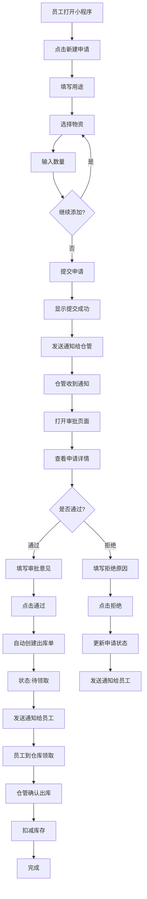
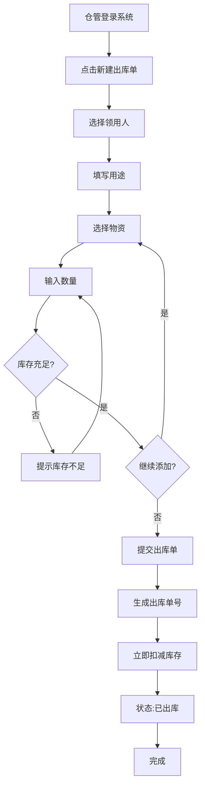
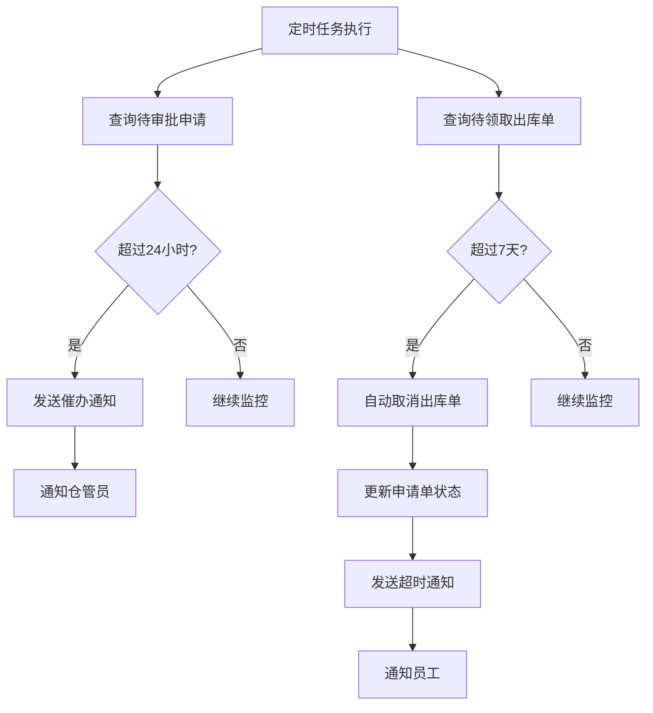

# 仓库管理系统原型设计文档

## 文档信息

| 项目 | 内容 |
|------|------|
| 系统名称 | 西藏电信仓库管理系统 (CT-Tibet-WMS) |
| 版本 | v1.0 |
| 文档状态 | 设计中 |
| 创建日期 | 2025-11-11 |
| 设计目标 | PC管理端 + 移动小程序端 |

---

## 目录

1. [设计概述](#1-设计概述)
2. [设计规范](#2-设计规范)
3. [PC端页面设计](#3-pc端页面设计)
4. [小程序端页面设计](#4-小程序端页面设计)
5. [交互流程设计](#5-交互流程设计)
6. [组件设计](#6-组件设计)
7. [状态设计](#7-状态设计)

---

## 1. 设计概述

### 1.1 设计目标

- **PC端**：面向仓管员、部门管理员、系统管理员，提供完整的管理功能
- **小程序端**：面向仓管员、普通员工，提供移动便捷操作

### 1.2 核心用户场景

| 用户角色 | 核心场景 | 主要平台 |
|---------|---------|---------|
| 系统管理员 | 用户管理、系统配置 | PC端 |
| 部门管理员 | 部门数据管理、查看报表 | PC端 |
| 仓库管理员 | 出入库操作、审批申请 | PC端 + 小程序 |
| 普通员工 | 提交申请、查看库存 | 小程序 |

### 1.3 设计原则

1. **简洁高效**：减少操作步骤，提高工作效率
2. **角色适配**：不同角色看到不同的菜单和功能
3. **状态清晰**：所有业务状态一目了然
4. **响应式**：PC端支持不同分辨率
5. **易用性**：符合用户操作习惯

---

## 2. 设计规范

### 2.1 颜色规范

#### 主题色

```
品牌色（Primary）:    #1890ff  □  用于主按钮、链接、高亮
成功色（Success）:    #52c41a  □  用于成功状态
警告色（Warning）:    #faad14  □  用于警告、低库存
错误色（Error）:      #f5222d  □  用于错误、拒绝
信息色（Info）:       #1890ff  □  用于信息提示
```

#### 中性色

```
标题文字:  #262626  ■
正文文字:  #595959  ■
辅助文字:  #8c8c8c  ■
禁用文字:  #bfbfbf  □
边框颜色:  #d9d9d9  □
背景色:    #fafafa  □
白色:      #ffffff  □
```

#### 业务状态色

```
待审批:  #faad14  □  橙色
已通过:  #52c41a  □  绿色
已拒绝:  #f5222d  □  红色
已出库:  #8c8c8c  □  灰色
已取消:  #bfbfbf  □  浅灰
```

### 2.2 字体规范

#### PC端

```
超大标题:  20px / 500  用于页面主标题
大标题:    18px / 500  用于区块标题
标题:      16px / 500  用于卡片标题
正文:      14px / 400  用于正文内容
辅助文字:  12px / 400  用于说明文字
```

**字体家族**: -apple-system, BlinkMacSystemFont, 'Segoe UI', 'PingFang SC', 'Hiragino Sans GB', 'Microsoft YaHei', sans-serif

#### 小程序端

```
标题:      36rpx / 500
副标题:    32rpx / 500
正文:      28rpx / 400
辅助文字:  24rpx / 400
```

### 2.3 间距规范

```
超小间距:  4px   用于紧密元素
小间距:    8px   用于表单项内间距
标准间距:  16px  用于卡片、区块间距
大间距:    24px  用于页面区块间距
超大间距:  32px  用于页面主区块间距
```

### 2.4 圆角规范

```
小圆角:  2px   用于按钮、输入框
标准圆角:4px   用于卡片
大圆角:  8px   用于大型卡片
```

### 2.5 阴影规范

```
浅阴影:  0 1px 2px rgba(0,0,0,0.03)  用于输入框
标准阴影:0 2px 8px rgba(0,0,0,0.09)  用于卡片
深阴影:  0 4px 16px rgba(0,0,0,0.12) 用于弹窗
```

---

## 3. PC端页面设计

### 3.1 整体布局

```
┌─────────────────────────────────────────────────────────────┐
│ 顶部导航栏 (Header) - 高度: 60px                             │
│ ┌───────────────┐                    ┌──────────┬─────────┐│
│ │ 📦 仓库管理系统 │                    │ 🔔 消息(3) │ 👤 李军▼││
│ └───────────────┘                    └──────────┴─────────┘│
├──────────┬──────────────────────────────────────────────────┤
│          │                                                   │
│          │                                                   │
│  侧边栏   │               主内容区域                          │
│  (Aside) │              (Main Content)                       │
│  宽度:    │                                                   │
│  200px   │                                                   │
│          │                                                   │
│          │                                                   │
│          │                                                   │
│          │                                                   │
└──────────┴──────────────────────────────────────────────────┘
```

#### 顶部导航栏（Header）

```
┌─────────────────────────────────────────────────────────────┐
│  Logo + 系统名称                            消息  语言  用户   │
│  ┌──┐                                                        │
│  │📦│ 仓库管理系统          🔔(3)  🌐中文  👤李军 ▼           │
│  └──┘                                                        │
└─────────────────────────────────────────────────────────────┘
```

**组件说明**：
- **Logo区域**：系统图标 + 名称，可点击回到首页
- **消息中心**：显示未读消息数量，点击展开消息列表
- **语言切换**：中文/English（可选功能）
- **用户菜单**：下拉菜单包含：个人信息、修改密码、退出登录

#### 侧边栏菜单（Sidebar）

**仓库管理员视图**：

```
┌────────────────┐
│  基础管理       │
│    📦 物资管理  │
│    🏢 仓库管理  │
├────────────────┤
│  入库管理       │
│    📥 入库单    │
├────────────────┤
│  出库管理       │
│    📤 出库单    │
│    ✅ 审批管理  │
├────────────────┤
│  库存管理       │
│    📊 库存查询  │
│    ⚠️  库存预警 │
├────────────────┤
│  统计报表       │
│    📈 出入库统计│
│    📊 物资统计  │
└────────────────┘
```

**普通员工视图**：

```
┌────────────────┐
│  申请管理       │
│    📝 新建申请  │
│    📋 我的申请  │
├────────────────┤
│  库存查询       │
│    📊 库存查询  │
└────────────────┘
```

### 3.2 核心页面设计

#### 3.2.1 入库单列表页

```
┌─────────────────────────────────────────────────────────────┐
│ 入库单管理                                     [+ 新建入库单] │
├─────────────────────────────────────────────────────────────┤
│                                                              │
│ 筛选条件:                                                    │
│ ┌──────────────────────────────────────────────────────┐   │
│ │ 入库类型: [全部 ▼]  仓库: [全部 ▼]  时间: [最近30天 ▼]│   │
│ │ 操作人: [全部 ▼]  关键词: [_______________] [🔍 搜索] │   │
│ └──────────────────────────────────────────────────────┘   │
│                                                              │
│ ┌──────────────────────────────────────────────────────┐   │
│ │入库单号       │类型  │仓库    │操作人│数量│时间      │操作││
│ ├──────────────────────────────────────────────────────┤   │
│ │RK_WL_20251110_│采购  │网运仓库│李军  │100 │2025-11-10│详情││
│ │RK_WL_20251109_│退货  │网运仓库│张三  │50  │2025-11-09│详情││
│ │RK_WL_20251108_│调拨  │网运仓库│李四  │80  │2025-11-08│详情││
│ └──────────────────────────────────────────────────────┘   │
│                                                              │
│ 共 45 条记录  每页显示 [20▼] 条                              │
│ [首页] [上一页] 1 2 [3] 4 5 [下一页] [尾页]                  │
└─────────────────────────────────────────────────────────────┘
```

**交互说明**：
1. 点击 **[+ 新建入库单]** → 跳转到入库单创建页
2. 点击 **[详情]** → 在右侧抽屉打开入库单详情
3. 支持**多条件筛选**，实时刷新列表
4. 支持**导出Excel**（右上角）

#### 3.2.2 新建入库单页面

```
┌─────────────────────────────────────────────────────────────┐
│ ← 返回列表   新建入库单                                      │
├─────────────────────────────────────────────────────────────┤
│                                                              │
│ 基本信息                                                     │
│ ┌──────────────────────────────────────────────────────┐   │
│ │ 入库仓库: [网络运维部仓库 ▼] *必填                      │   │
│ │ 入库类型: [采购入库 ▼] *必填                           │   │
│ │          (采购入库/退货入库/调拨入库/其他)              │   │
│ │ 入库时间: [2025-11-10 14:30] *必填                     │   │
│ │ 备注说明: [_________________________________]           │   │
│ └──────────────────────────────────────────────────────┘   │
│                                                              │
│ 物资明细                                    [+ 添加物资]     │
│ ┌──────────────────────────────────────────────────────┐   │
│ │ 序号│物资名称  │规格    │单位│数量  │单价  │金额│操作││   │
│ ├──────────────────────────────────────────────────────┤   │
│ │ 1  │光缆12芯  │12芯单模│条  │[100]│1500 │150k│删除││   │
│ │ 2  │交换机H3C │S5130   │台  │[5]  │7800 │39k │删除││   │
│ │ -  │          │        │    │     │     │    │    ││   │
│ └──────────────────────────────────────────────────────┘   │
│                                                              │
│ 合计金额: ¥189,000.00                                       │
│                                                              │
│                              [保存草稿] [提交入库]           │
└─────────────────────────────────────────────────────────────┘
```

**添加物资弹窗**：

```
┌─────────────────────────────────────┐
│ 选择物资                    [关闭 ✕]│
├─────────────────────────────────────┤
│ 搜索: [____________] [🔍]          │
│ 类别: [全部▼]                       │
│                                     │
│ ┌─────────────────────────────────┐│
│ │☐ 光缆12芯  | 12芯单模 | 库存:850│││
│ │☐ 光缆24芯  | 24芯单模 | 库存:320│││
│ │☑ 交换机H3C | S5130    | 库存:18 │││
│ │☐ 网线      | 超五类   | 库存:1850│││
│ └─────────────────────────────────┘│
│                                     │
│        [取消]        [确定(1)]      │
└─────────────────────────────────────┘
```

#### 3.2.3 审批管理页面

```
┌─────────────────────────────────────────────────────────────┐
│ 审批管理                                                     │
├─────────────────────────────────────────────────────────────┤
│ [待审批 (3)] [已审批] [全部]                                 │
├─────────────────────────────────────────────────────────────┤
│                                                              │
│ 筛选: 申请人[_______]  时间[最近7天▼]  [🔍搜索]            │
│                                                              │
│ ┌──────────────────────────────────────────────────────┐   │
│ │ ⏳ 待审批                                             │   │
│ │                                                       │   │
│ │ 申请单号: SQ_WL_20251110_0001                         │   │
│ │ 申请人: 张强 (13800000003)                            │   │
│ │ 申请时间: 2025-11-10 09:30                            │   │
│ │ 用途: XX小区光缆施工                                   │   │
│ │ 物资: 光缆12芯 10条、交换机H3C 2台                     │   │
│ │                                                       │   │
│ │                            [拒绝] [审批通过]          │   │
│ └──────────────────────────────────────────────────────┘   │
│                                                              │
│ ┌──────────────────────────────────────────────────────┐   │
│ │ ⏳ 待审批                                             │   │
│ │                                                       │   │
│ │ 申请单号: SQ_WL_20251110_0002                         │   │
│ │ 申请人: 李四 (13800000004)                            │   │
│ │ 申请时间: 2025-11-10 10:15                            │   │
│ │ 用途: 机房设备维护                                     │   │
│ │ 物资: 网线超五类 50米                                  │   │
│ │                                                       │   │
│ │                            [拒绝] [审批通过]          │   │
│ └──────────────────────────────────────────────────────┘   │
└─────────────────────────────────────────────────────────────┘
```

**点击[审批通过]弹窗**：

```
┌─────────────────────────────────────┐
│ 审批申请               [关闭 ✕]     │
├─────────────────────────────────────┤
│ 申请单号: SQ_WL_20251110_0001       │
│ 申请人: 张强                         │
│ 申请时间: 2025-11-10 09:30          │
│                                     │
│ 申请物资:                            │
│ ┌─────────────────────────────────┐│
│ │ 光缆12芯  10条  库存: 850条 ✓   ││
│ │ 交换机H3C 2台   库存: 18台  ✓   ││
│ └─────────────────────────────────┘│
│                                     │
│ 库存检查: ✓ 库存充足                │
│                                     │
│ 审批意见:                            │
│ ┌─────────────────────────────────┐│
│ │ 同意,请按时领取                  ││
│ └─────────────────────────────────┘│
│                                     │
│       [拒绝]          [通过]        │
└─────────────────────────────────────┘
```

#### 3.2.4 库存查询页面

```
┌─────────────────────────────────────────────────────────────┐
│ 库存查询                                      [📥 导出Excel] │
├─────────────────────────────────────────────────────────────┤
│                                                              │
│ 筛选:                                                        │
│ ┌──────────────────────────────────────────────────────┐   │
│ │ 仓库: [网络运维部仓库▼]  类别: [全部▼]  状态: [全部▼]│   │
│ │ 关键词: [____________] [🔍 搜索]                      │   │
│ └──────────────────────────────────────────────────────┘   │
│                                                              │
│ 统计: 总物资 20 种  |  库存充足 17  |  ⚠️ 低库存 2  |  ⛔ 缺货 1│
│                                                              │
│ ┌──────────────────────────────────────────────────────┐   │
│ │物资名称  │规格    │单位│当前库存│锁定│可用│预警值│状态││   │
│ ├──────────────────────────────────────────────────────┤   │
│ │光缆12芯  │12芯单模│条  │850    │0  │850 │100  │✓正常││   │
│ │交换机H3C │S5130   │台  │18     │2  │16  │10   │✓正常││   │
│ │网线超五类│Cat5e   │米  │8      │0  │8   │500  │⚠️低 ││   │
│ │光功率计  │手持式  │台  │0      │0  │0   │5    │⛔缺货││   │
│ └──────────────────────────────────────────────────────┘   │
│                                                              │
│ 共 20 条  [首页] [上页] 1 [2] 3 [下页] [尾页]               │
└─────────────────────────────────────────────────────────────┘
```

**点击物资名称查看详情**：

```
┌─────────────────────────────────────┐
│ 库存详情               [关闭 ✕]     │
├─────────────────────────────────────┤
│ 📦 光缆12芯                          │
│ ─────────────────────────────────  │
│ 物资编码: GX001                      │
│ 规格型号: 12芯单模                   │
│ 单位: 条                             │
│ 单价: ¥1,500.00                     │
│                                     │
│ 库存信息:                            │
│ • 当前库存: 850 条                   │
│ • 锁定数量: 0 条                     │
│ • 可用数量: 850 条                   │
│ • 预警阈值: 100 条                   │
│ • 库存状态: ✓ 正常                  │
│                                     │
│ 最近动态:                            │
│ ┌─────────────────────────────────┐│
│ │ 11-10 入库 +100 | 采购入库       ││
│ │ 11-09 出库 -50  | 张强领用       ││
│ │ 11-08 入库 +200 | 采购入库       ││
│ └─────────────────────────────────┘│
│                                     │
│              [关闭]                 │
└─────────────────────────────────────┘
```

#### 3.2.5 出库单列表（待领取）

```
┌─────────────────────────────────────────────────────────────┐
│ 出库单管理                                   [+ 新建出库单] │
├─────────────────────────────────────────────────────────────┤
│ [全部] [待领取 (3)] [已出库] [已取消]                        │
├─────────────────────────────────────────────────────────────┤
│                                                              │
│ ┌──────────────────────────────────────────────────────┐   │
│ │出库单号    │来源│领用人│物资      │状态  │时间  │操作││   │
│ ├──────────────────────────────────────────────────────┤   │
│ │CK_WL_2025..│申请│张强  │光缆等2项 │⏳待领取│11-10│确认││   │
│ │CK_WL_2025..│直接│李四  │交换机1台 │✓已出库│11-09│详情││   │
│ │CK_WL_2025..│申请│王五  │网线50米  │❌已取消│11-08│详情││   │
│ └──────────────────────────────────────────────────────┘   │
│                                                              │
│ 待领取: 3条 (最早: 11-08, 已等待3天)                         │
└─────────────────────────────────────────────────────────────┘
```

**点击[确认]按钮弹窗**：

```
┌─────────────────────────────────────┐
│ 确认出库               [关闭 ✕]     │
├─────────────────────────────────────┤
│ 📦 出库确认                          │
│                                     │
│ 领用人: 张强 (13800000003)          │
│ 申请单号: SQ_WL_20251110_0001       │
│                                     │
│ 出库物资:                            │
│ • 光缆12芯  10条                     │
│ • 交换机H3C 2台                      │
│                                     │
│ ✓ 库存检查通过                       │
│                                     │
│ ☑ 员工已到场签字确认                 │
│                                     │
│ 提示: 确认后将立即扣减库存            │
│                                     │
│       [取消]        [确认出库]       │
└─────────────────────────────────────┘
```

---

## 4. 小程序端页面设计

### 4.1 整体布局

小程序采用底部 TabBar 导航：

#### 仓库管理员 TabBar

```
┌─────────────────────────┐
│                         │
│      页面内容区域        │
│                         │
│                         │
├─────────────────────────┤
│ 🏠    📥    📤    ✅   👤 │
│ 首页  入库  出库  审批  我的│
└─────────────────────────┘
```

#### 普通员工 TabBar

```
┌─────────────────────────┐
│                         │
│      页面内容区域        │
│                         │
│                         │
├─────────────────────────┤
│ 🏠    📝    📦    👤    │
│ 首页  申请  库存  我的   │
└─────────────────────────┘
```

### 4.2 核心页面设计

#### 4.2.1 首页（仓库管理员）

```
┌─────────────────────────┐
│ 西藏电信仓库管理系统     │
│ 👤 李军 | 网络运维部      │
├─────────────────────────┤
│                         │
│ 📊 今日数据              │
│ ┌─────┬─────┬─────┬───┐│
│ │入库 │出库 │待审批│库存│││
│ │ 5   │ 12  │  3  │ 20 ││
│ └─────┴─────┴─────┴───┘│
│                         │
│ 🔔 待办事项              │
│ ┌─────────────────────┐│
│ │ ⏳ 3条申请待审批      ││
│ │ 📦 5条出库待确认      ││
│ │ ⚠️  2种物资库存预警   ││
│ └─────────────────────┘│
│                         │
│ ⚡ 快捷操作              │
│ ┌────────┬────────────┐│
│ │📥 快速入库│📤 快速出库 ││
│ ├────────┼────────────┤│
│ │✅ 审批申请│📊 查看库存 ││
│ └────────┴────────────┘│
│                         │
│ 📈 最近操作              │
│ ┌─────────────────────┐│
│ │ 11-10 入库 光缆100条 ││
│ │ 11-10 审批 张强的申请 ││
│ │ 11-09 出库 交换机5台 ││
│ └─────────────────────┘│
└─────────────────────────┘
```

#### 4.2.2 首页（普通员工）

```
┌─────────────────────────┐
│ 西藏电信仓库管理系统     │
│ 👤 张强 | 网络运维部      │
├─────────────────────────┤
│                         │
│ 📋 我的申请              │
│ ┌─────────────────────┐│
│ │ 待审批: 1条          ││
│ │ 已通过: 2条          ││
│ │ 待领取: 1条          ││
│ └─────────────────────┘│
│                         │
│ ⚡ 快捷操作              │
│ ┌─────────────────────┐│
│ │   📝 新建申请         ││
│ └─────────────────────┘│
│ ┌────────┬────────────┐│
│ │📋 我的申请│📊 查看库存 ││
│ └────────┴────────────┘│
│                         │
│ 🔔 通知消息              │
│ ┌─────────────────────┐│
│ │ ✓ 您的申请已通过     ││
│ │   申请单号: SQ_WL... ││
│ │   请到仓库领取       ││
│ │   11-10 10:30       ││
│ ├─────────────────────┤│
│ │ ✗ 您的申请已拒绝     ││
│ │   申请单号: SQ_WL... ││
│ │   拒绝原因: 库存不足 ││
│ │   11-09 14:20       ││
│ └─────────────────────┘│
└─────────────────────────┘
```

#### 4.2.3 新建申请页（员工）

```
┌─────────────────────────┐
│ < 返回  新建领用申请     │
├─────────────────────────┤
│                         │
│ 用途说明 *               │
│ ┌─────────────────────┐│
│ │ XX小区光缆施工        ││
│ │                      ││
│ └─────────────────────┘│
│                         │
│ 已选物资 (2)             │
│                         │
│ ┌─────────────────────┐│
│ │ 📦 光缆12芯          ││
│ │ 数量: 10 条          ││
│ │ 当前库存: 850 条 ✓   ││
│ │       [修改] [删除]  ││
│ └─────────────────────┘│
│                         │
│ ┌─────────────────────┐│
│ │ 📦 交换机H3C         ││
│ │ 数量: 2 台           ││
│ │ 当前库存: 18 台 ✓    ││
│ │       [修改] [删除]  ││
│ └─────────────────────┘│
│                         │
│ ┌─────────────────────┐│
│ │   + 添加物资          ││
│ └─────────────────────┘│
│                         │
│ 💡 提示: 申请提交后需等待 │
│    仓管审批,预计24小时内 │
│                         │
│ ┌─────────────────────┐│
│ │     提交申请          ││
│ └─────────────────────┘│
└─────────────────────────┘
```

**选择物资弹窗**：

```
┌─────────────────────────┐
│ 选择物资         [✕]    │
├─────────────────────────┤
│ 🔍 [搜索物资...]        │
│                         │
│ 类别: [全部▼]           │
├─────────────────────────┤
│ ☐ 光缆12芯              │
│    12芯单模 | 库存:850条│
│ ─────────────────────── │
│ ☐ 光缆24芯              │
│    24芯单模 | 库存:320条│
│ ─────────────────────── │
│ ☑ 交换机H3C             │
│    S5130 | 库存:18台    │
│ ─────────────────────── │
│ ☐ 网线超五类            │
│    Cat5e | ⚠️ 库存:8米  │
│ ─────────────────────── │
│                         │
├─────────────────────────┤
│   [取消]    [确定(1)]   │
└─────────────────────────┘
```

**输入数量弹窗**：

```
┌─────────────────────────┐
│ 输入数量         [✕]    │
├─────────────────────────┤
│ 物资: 光缆12芯           │
│ 规格: 12芯单模           │
│ 单位: 条                │
│ 当前库存: 850 条         │
│                         │
│ 申请数量:                │
│ ┌─────────────────────┐│
│ │      [  10  ]        ││
│ └─────────────────────┘│
│                         │
│ 常用数量:                │
│  [5]  [10]  [20]  [50] │
│                         │
│ 💡 提示: 申请数量不应超过│
│    当前库存              │
│                         │
│    [取消]    [确定]     │
└─────────────────────────┘
```

#### 4.2.4 我的申请列表（员工）

```
┌─────────────────────────┐
│ 我的申请                │
├─────────────────────────┤
│ [待审批] [已通过]        │
│ [已拒绝] [全部]          │
├─────────────────────────┤
│                         │
│ ⏳ 待审批                │
│ ┌─────────────────────┐│
│ │ 📋 光缆等2项         ││
│ │ 申请时间: 11-10 09:30││
│ │ 申请单号: SQ_WL_001  ││
│ │ 用途: XX小区光缆施工 ││
│ │                      ││
│ │       [撤销申请]     ││
│ └─────────────────────┘│
│                         │
│ ✓ 已通过                │
│ ┌─────────────────────┐│
│ │ 📋 交换机等1项       ││
│ │ 申请时间: 11-09 14:00││
│ │ 审批时间: 11-09 15:20││
│ │ 审批意见: 同意        ││
│ │ 状态: 等待领取       ││
│ │                      ││
│ │       [去领取]       ││
│ └─────────────────────┘│
│                         │
│ ✗ 已拒绝                │
│ ┌─────────────────────┐│
│ │ 📋 网线50米          ││
│ │ 申请时间: 11-08 10:00││
│ │ 审批时间: 11-08 11:30││
│ │ 拒绝原因: 库存不足   ││
│ │                      ││
│ │      [重新申请]      ││
│ └─────────────────────┘│
└─────────────────────────┘
```

#### 4.2.5 审批管理（仓管）

```
┌─────────────────────────┐
│ 审批管理                │
├─────────────────────────┤
│ 待审批 (3)               │
├─────────────────────────┤
│                         │
│ ┌─────────────────────┐│
│ │ 📋 张强的申请        ││
│ │ 光缆12芯 10条        ││
│ │ 交换机H3C 2台        ││
│ │ 申请时间: 11-10 09:30││
│ │ 用途: XX小区光缆施工 ││
│ │                      ││
│ │    [查看详情]        ││
│ └─────────────────────┘│
│                         │
│ ┌─────────────────────┐│
│ │ 📋 李四的申请        ││
│ │ 网线超五类 50米      ││
│ │ 申请时间: 11-10 10:15││
│ │ 用途: 机房设备维护   ││
│ │                      ││
│ │    [查看详情]        ││
│ └─────────────────────┘│
│                         │
│ ┌─────────────────────┐│
│ │ 📋 王五的申请        ││
│ │ 光功率计 1台         ││
│ │ 申请时间: 11-10 11:00││
│ │ 用途: 现场测试       ││
│ │ ⚠️  库存不足: 0台    ││
│ │                      ││
│ │    [查看详情]        ││
│ └─────────────────────┘│
└─────────────────────────┘
```

**审批详情页**：

```
┌─────────────────────────┐
│ < 返回  审批申请         │
├─────────────────────────┤
│                         │
│ 申请人: 张强             │
│ 手机号: 138****0003     │
│ 部门: 网络运维部         │
│ 申请时间: 11-10 09:30   │
│                         │
│ 用途说明:                │
│ ┌─────────────────────┐│
│ │ XX小区光缆施工        ││
│ └─────────────────────┘│
│                         │
│ 申请物资:                │
│                         │
│ • 光缆12芯  10条         │
│   当前库存: 850条 ✓     │
│                         │
│ • 交换机H3C  2台         │
│   当前库存: 18台 ✓      │
│                         │
│ ✓ 库存检查: 库存充足     │
│                         │
│ 审批意见:                │
│ ┌─────────────────────┐│
│ │ 同意,请按时领取       ││
│ └─────────────────────┘│
│                         │
│ ┌──────┬──────────────┐│
│ │ 拒绝  │   通过       ││
│ └──────┴──────────────┘│
└─────────────────────────┘
```

#### 4.2.6 快速入库（仓管）

```
┌─────────────────────────┐
│ < 返回  快速入库         │
├─────────────────────────┤
│                         │
│ 入库仓库:                │
│ 网络运维部仓库           │
│                         │
│ 入库类型:                │
│ [采购入库 ▼]            │
│                         │
│ 选择物资:                │
│ ┌─────────────────────┐│
│ │  [点击选择物资...]   ││
│ └─────────────────────┘│
│                         │
│ 已选物资:                │
│                         │
│ ┌─────────────────────┐│
│ │ 📦 光缆12芯          ││
│ │ 数量: [100] 条       ││
│ │      [修改] [删除]   ││
│ └─────────────────────┘│
│                         │
│ 备注:                    │
│ ┌─────────────────────┐│
│ │ 采购入库              ││
│ └─────────────────────┘│
│                         │
│ ┌─────────────────────┐│
│ │     提交入库          ││
│ └─────────────────────┘│
└─────────────────────────┘
```

#### 4.2.7 库存查询

```
┌─────────────────────────┐
│ 库存查询                │
├─────────────────────────┤
│ 🔍 [搜索物资...]        │
│ 仓库: [网运仓库▼]        │
│ 类别: [全部▼]           │
├─────────────────────────┤
│                         │
│ 统计: 总数 20  正常 17   │
│      ⚠️ 低库存 2  ⛔ 缺货 1│
├─────────────────────────┤
│                         │
│ ✓ 光缆12芯              │
│ ┌─────────────────────┐│
│ │ 库存: 850 条         ││
│ │ 锁定: 0 条           ││
│ │ 可用: 850 条         ││
│ │ 预警值: 100 条       ││
│ └─────────────────────┘│
│                         │
│ ✓ 交换机H3C             │
│ ┌─────────────────────┐│
│ │ 库存: 18 台          ││
│ │ 锁定: 2 台           ││
│ │ 可用: 16 台          ││
│ │ 预警值: 10 台        ││
│ └─────────────────────┘│
│                         │
│ ⚠️  网线超五类           │
│ ┌─────────────────────┐│
│ │ 库存: 8 米 ⚠️         ││
│ │ 锁定: 0 米           ││
│ │ 可用: 8 米           ││
│ │ 预警值: 500 米       ││
│ └─────────────────────┘│
│                         │
│ ⛔ 光功率计              │
│ ┌─────────────────────┐│
│ │ 库存: 0 台 ⛔         ││
│ │ 锁定: 0 台           ││
│ │ 可用: 0 台           ││
│ │ 预警值: 5 台         ││
│ └─────────────────────┘│
└─────────────────────────┘
```

---

## 5. 交互流程设计

### 5.1 员工申请领用完整流程



### 5.2 仓管直接出库流程



### 5.3 审批超时处理流程



---

## 6. 组件设计

### 6.1 按钮组件

#### 主要按钮（Primary）

```
┌──────────┐
│ 提交申请  │  蓝色 #1890ff | 高度:32px | 圆角:2px
└──────────┘
```

#### 次要按钮（Default）

```
┌──────────┐
│ 取消     │  白色边框 | 高度:32px | 圆角:2px
└──────────┘
```

#### 危险按钮（Danger）

```
┌──────────┐
│ 删除     │  红色 #f5222d | 高度:32px | 圆角:2px
└──────────┘
```

#### 文本按钮（Text）

```
[ 查看详情 ]  蓝色文字 #1890ff | 无边框
```

### 6.2 状态标签

```
⏳ 待审批   黄色 #faad14
✓ 已通过   绿色 #52c41a
✗ 已拒绝   红色 #f5222d
✓ 已出库   灰色 #8c8c8c
⊘ 已取消   浅灰 #bfbfbf
⚠️  低库存   橙色 #faad14
⛔ 缺货     红色 #f5222d
```

### 6.3 表单组件

#### 输入框

```
┌────────────────────────┐
│ [请输入...]             │  高度:32px | 边框:#d9d9d9
└────────────────────────┘
```

#### 下拉选择

```
┌────────────────────────┐
│ 请选择                ▼│  高度:32px | 边框:#d9d9d9
└────────────────────────┘
```

#### 文本域

```
┌────────────────────────┐
│                        │
│ [请输入...]             │  高度:80px | 边框:#d9d9d9
│                        │
└────────────────────────┘
```

#### 数字输入

```
┌────────────────────────┐
│  [-]  [  100  ]  [+]   │  高度:32px | 步长可调
└────────────────────────┘
```

### 6.4 表格组件

```
┌──────────────────────────────────────┐
│ 列头1      │ 列头2    │ 列头3  │操作│
├──────────────────────────────────────┤
│ 数据1      │ 数据2    │ 数据3  │编辑│
│ 数据1      │ 数据2    │ 数据3  │编辑│
└──────────────────────────────────────┘

样式:
- 表头背景: #fafafa
- 边框: #f0f0f0
- 斑马纹: 奇数行 #ffffff, 偶数行 #fafafa
- Hover: #e6f7ff
```

### 6.5 卡片组件

```
┌────────────────────────┐
│ 卡片标题                │
├────────────────────────┤
│                        │
│ 卡片内容                │
│                        │
└────────────────────────┘

样式:
- 背景: #ffffff
- 边框: #d9d9d9
- 圆角: 4px
- 阴影: 0 2px 8px rgba(0,0,0,0.09)
- 内边距: 16px
```

### 6.6 空状态组件

```
┌────────────────────────┐
│          📭            │
│                        │
│      暂无数据           │
│                        │
│   [+ 新建第一条]        │
└────────────────────────┘
```

### 6.7 加载状态

```
┌────────────────────────┐
│          ⏳            │
│                        │
│      加载中...          │
└────────────────────────┘
```

---

## 7. 状态设计

### 7.1 申请单状态

| 状态值 | 显示 | 颜色 | 可操作 |
|-------|------|------|--------|
| 0 待审批 | ⏳ 待审批 | #faad14 | 撤销申请 |
| 1 已通过 | ✓ 已通过 | #52c41a | 去领取 |
| 2 已拒绝 | ✗ 已拒绝 | #f5222d | 重新申请 |
| 3 已出库 | ✓ 已出库 | #8c8c8c | 查看详情 |
| 4 已取消 | ⊘ 已取消 | #bfbfbf | 重新申请 |

### 7.2 出库单状态

| 状态值 | 显示 | 颜色 | 可操作 |
|-------|------|------|--------|
| 0 待领取 | ⏳ 待领取 | #faad14 | 确认出库 |
| 1 已出库 | ✓ 已出库 | #52c41a | 查看详情 |
| 2 已取消 | ⊘ 已取消 | #bfbfbf | 查看详情 |

### 7.3 库存状态

| 状态 | 显示 | 颜色 | 判断条件 |
|------|------|------|---------|
| 正常 | ✓ 正常 | #52c41a | quantity > min_stock |
| 低库存 | ⚠️  低库存 | #faad14 | 0 < quantity ≤ min_stock |
| 缺货 | ⛔ 缺货 | #f5222d | quantity = 0 |

### 7.4 消息已读状态

```
未读消息:
┌────────────────────────┐
│ 🔴 您的申请已通过        │  左侧红点
│    申请单号: SQ_WL_001  │  背景: #e6f7ff
│    11-10 10:30         │
└────────────────────────┘

已读消息:
┌────────────────────────┐
│ ✓ 您的申请已通过         │  无红点
│   申请单号: SQ_WL_001   │  背景: #ffffff
│   11-10 10:30          │
└────────────────────────┘
```

---

## 8. 响应式设计

### 8.1 PC端断点

```
超大屏幕: ≥ 1920px  显示完整布局 + 大间距
大屏幕:   ≥ 1440px  显示完整布局
中屏幕:   ≥ 1024px  正常布局
小屏幕:   < 1024px  收起侧边栏,使用顶部菜单
```

### 8.2 表格响应式

```
宽屏: 显示所有列
窄屏: 隐藏次要列,保留核心信息 + 操作列
移动: 卡片式布局,每行显示一条记录
```

---

## 附录

### A. 图标库

推荐使用：
- **Ant Design Icons**: https://ant.design/components/icon-cn/
- **Element Plus Icons**: https://element-plus.org/zh-CN/component/icon.html

### B. 动画效果

```
页面切换: 淡入淡出 300ms
弹窗打开: 缩放动画 200ms
列表展开: 高度动画 300ms
按钮点击: 水波纹效果
加载状态: 旋转动画
```

### C. 交互反馈

```
成功操作: 绿色提示 + ✓ 图标 | 持续 3秒
错误操作: 红色提示 + ✗ 图标 | 持续 5秒
警告提示: 黄色提示 + ⚠️  图标 | 持续 4秒
信息提示: 蓝色提示 + ℹ️ 图标 | 持续 3秒
```

---

**文档结束**
